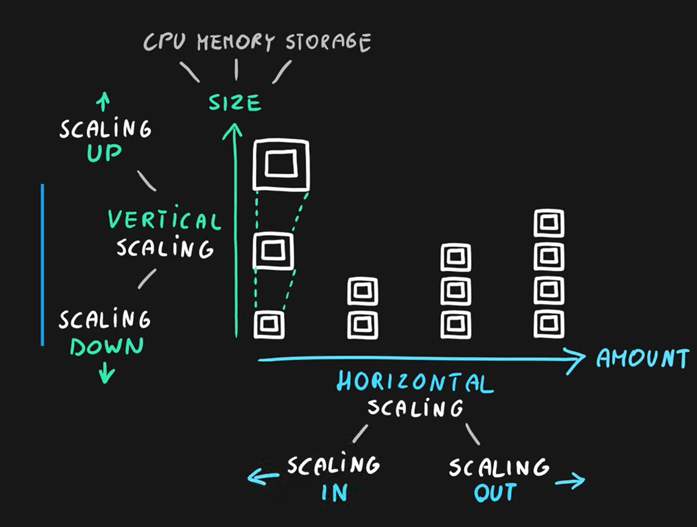
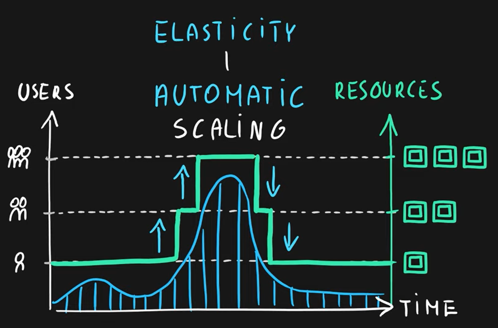
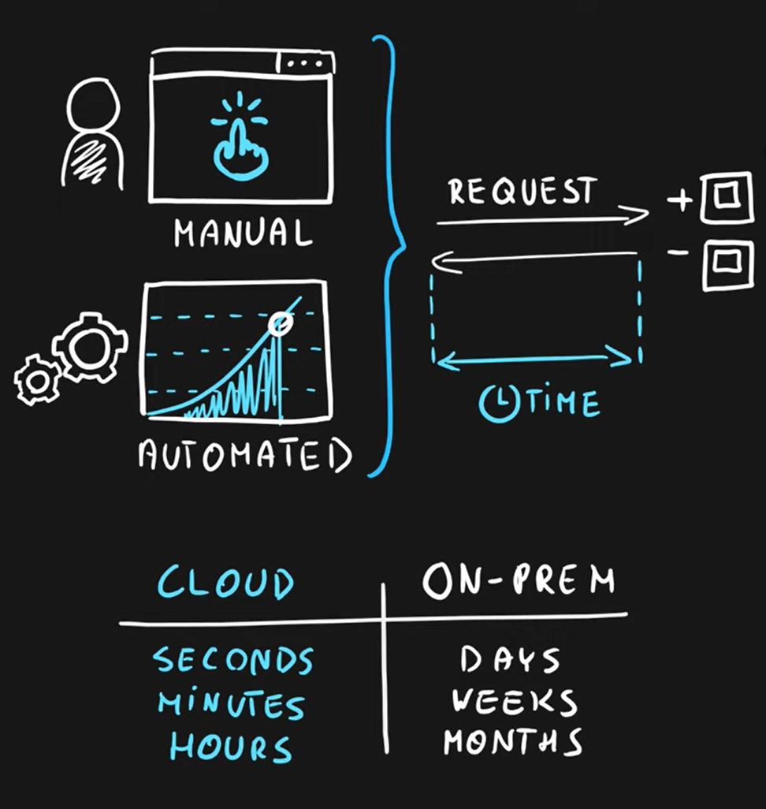
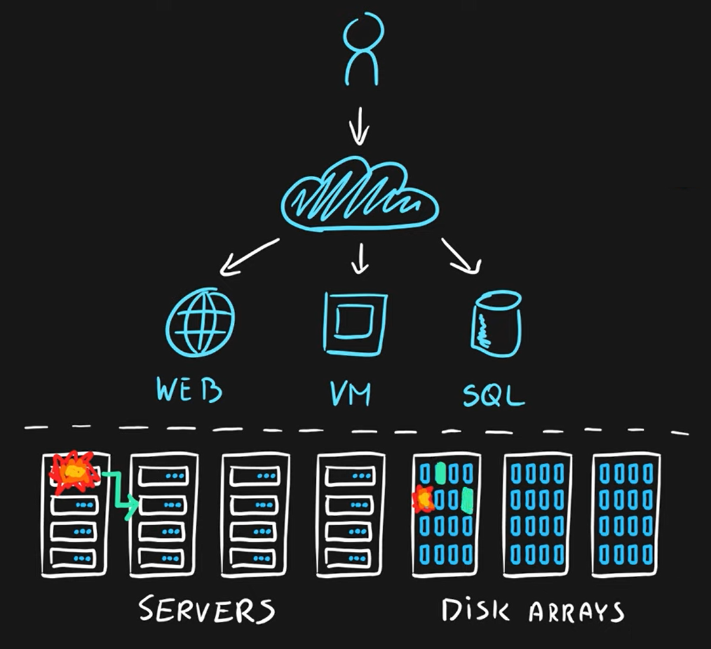
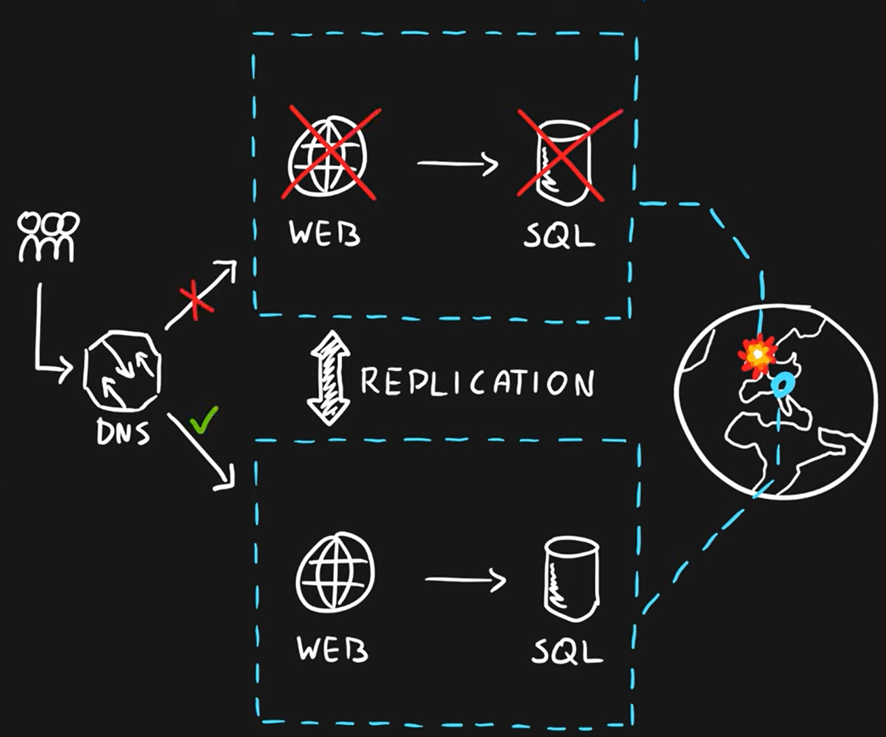
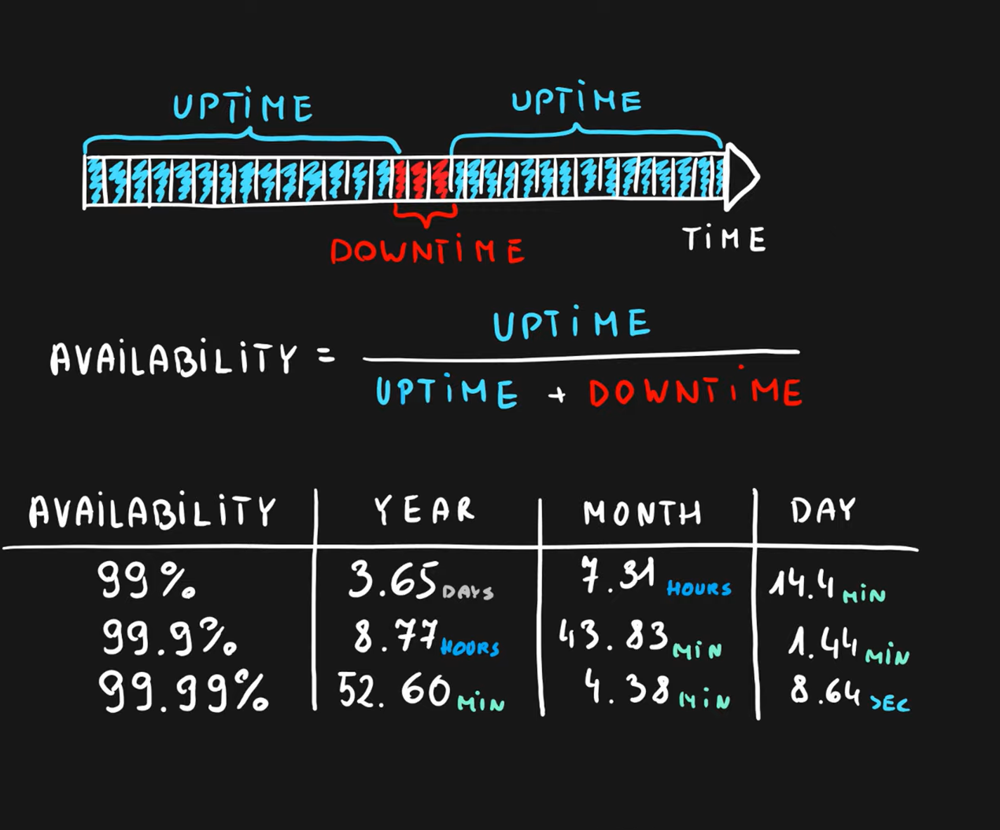

# Cloud Computing
*Service delivery model over the internet* (cloud). This includes but is not limited to:

- **Compute power** meaning servers such as windows, linux, hosting environments, etc.
- **Storage** like files and/or databases
- **Networking** in azure but also outside when connecting to your company network
- **Analytics services** for visualization and telemetry data

**Services** are **resources** might both mean the virtual resources like CPU, RAM, MEM but also a specific instances of the resources (service).

##### Key Characteristics (Đặc điểm chính)
- **Scalability** (Tính khả mở): the ability to scale. Scaling is a process of allocating (adding) or deallocating (removing) resource. There are two type of scaling:
    - **Vertical scaling** (Size): add or remove power like CPU, RAM, MEM ...
        - Increasing the size of resouce called **scaling up**.
        - Decreasing the size of resouce called **scaling down**.
    - **Horizontal scaling** (Amount).
        - Increasing amount of resource called **scaling out**.
        - Decreasing amount of resource called **scaling in**. 
- **Elasticity** (Độ đàn hồi): the ability to scale dynamically
- **Agility** (Độ nhanh nhẹn): the ability to react quickly (allocate or deallocate resources quickly)
- **Fault Tolerance** (Khả năng chịu lỗi): the ability to remain up and running during component and service failures.
- **Disaster Recovery** (Khôi phục thảm họa): the ability to recover from an event that has taken down the service (disaster: is a serious disruption of services caused by natural or human-included causes)
- **High Availability** (Độ sẵn sàng cao): the ability to keep services running for *extended periods of time* (khoảng thời gian dài) with very little downtime.
    - *Availability* is a measure of system uptime for user/services. Availability = uptime / (uptime + downtime)

