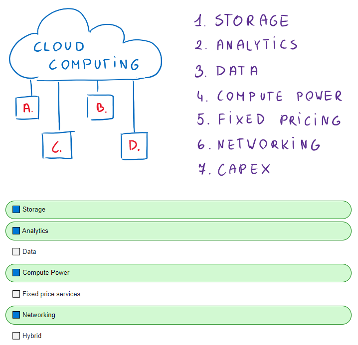
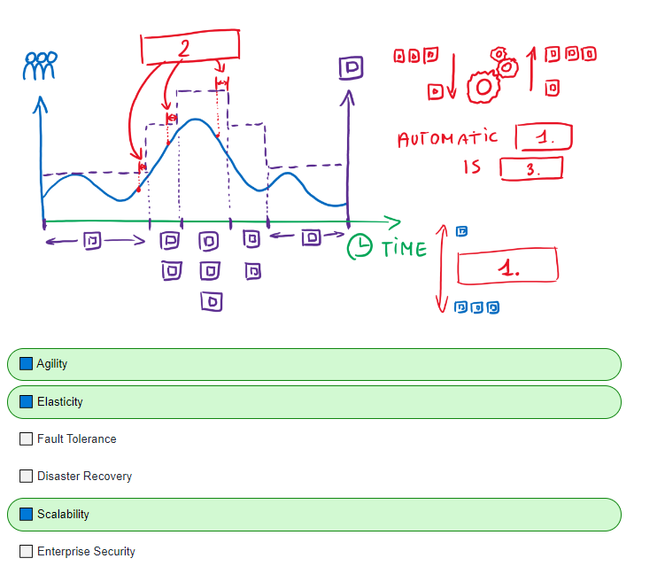

# Question 1
Cloud computing is a delivery model for what four service types?

> **Note:** While cloud computing contains a number of service types,
>the four most common ones by the definition are **Compute Power, 
>Storage, Networking and Analytics**

# Question 2
Match the 3 most appropriate words that describe how the cloud helps with 
the allocation of resources

> **Note:** **Scalability** is the system's ablity to scale (allocate/deallocate) resources.
> **Agility** is the ability to scale quickly. If that scaling is happening automatically,
> then we call it **Elasticity**. All of those terms directly explain the system's ability
> to change resources at will.