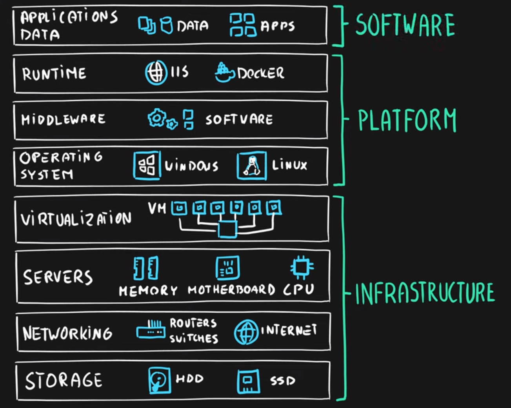
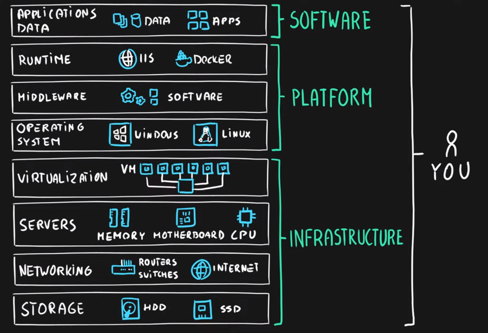
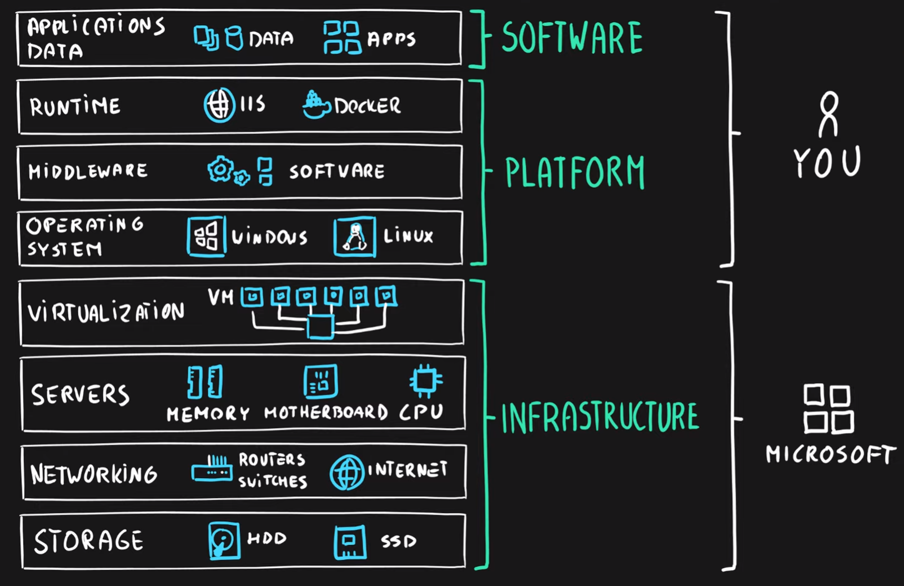
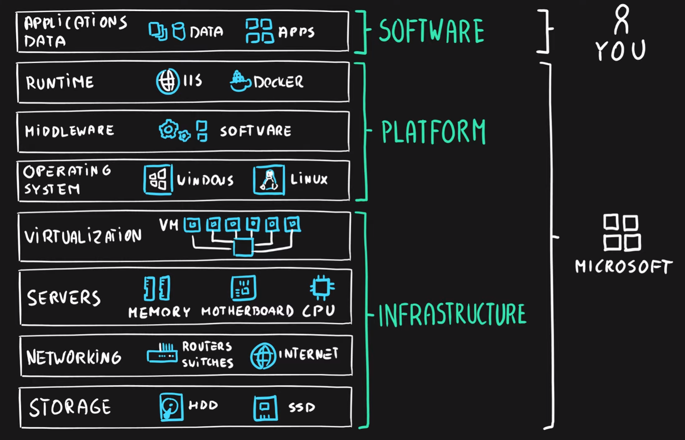
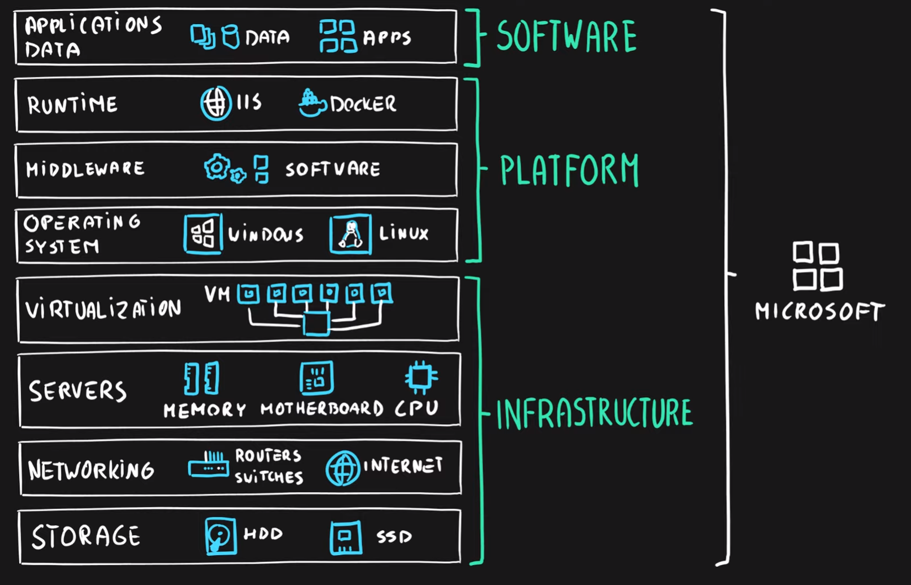

# Service Models responsibilities
**As a service** means which party will manage the particular layer and all the layers below.

- **Software** layer consists the application (application code and set) & the application data
- **Platform** layer means all the supporting software and the operating system required to host the application
- **Infrastructure** layer consists hardware the infrastructure and virtualization required to host the platform

| Layer            | Type              |
| ---------------- | :---------------: |
| Application      |	Software       |
| Data             |	Software       |
| Runtime          |	Platform       |
| Middleware       |	Platform       |
| Operating System |	Platform       |
| Virtualization   |	Infrastructure |
| Servers          |	Infrastructure |
| Networking       |	Infrastructure |
| Storage          |	Infrastructure |

# On-Premises
- **Cloud provider** manages **nothing**
- **You** manage **everything**
  - **Infrastructure** - networking, hardware & virtualization
  - **Platfrom** - operating system, middleware, runtime
  - **Software** - data & applications

# Infrastructure as a Service
- **Cloud provider** manages **Infrastructure**
  - **Infrastructure** - networking, hardware & virtualization
- **You** manage **platform** & **software**
  - **Platform** - operating system, middleware, runtime
  - **Software** - data & applications

**Ex:** Virtual Machine, Virtual Network, Managed Disk

# Platform as a Service
- **Cloud provider** manages **Infrastructure** & **Platform**
  - **Infrastructure** - networking, hardware & virtualization
  - **Platform** - operating system, middleware, runtime
- **You** manage **software**
  - **Software** - data & applications
  
**Ex:** Sql Service, App Service, Logic Apps, Function Apps

# Software as a Service
- **Cloud provider** manages **everything**
  - **Infrastructure** - networking, hardware & virtualization
  - **Platform** - operating system, middleware, runtime
  - **Software** - data & applications
- **You** manage **nothing**
  
**Ex:** Outlook, Skype, OneDrive ...

