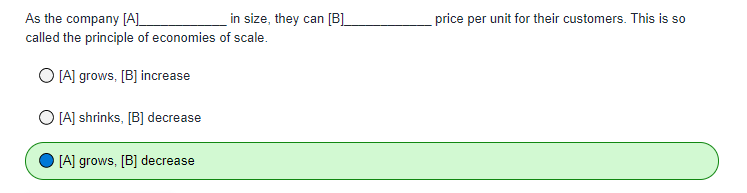

# Question 1

>**Note:** When companies **grow** in size, they become more effective at what they do.
Thanks to this, they can reduce their operational costs and therefore **decrease** their
price per unit.

# Question 2

>**Note:** Bigger companies can build internal teams, share resources, invest in research,
negotiate prices, etc. All this leads to a lower price per unit. Unfortunately, small companies
can’t do that which leads to a **high** unit per price.

# Question 3

>**Note:** Microsoft is a big company, Azure is also big. Because of that, their
price per unit is low and as such customers can take advantage of competitive
infrastructure and platform pricing. This is so-called **economies of scale** principle
which is one of the cloud benefits.