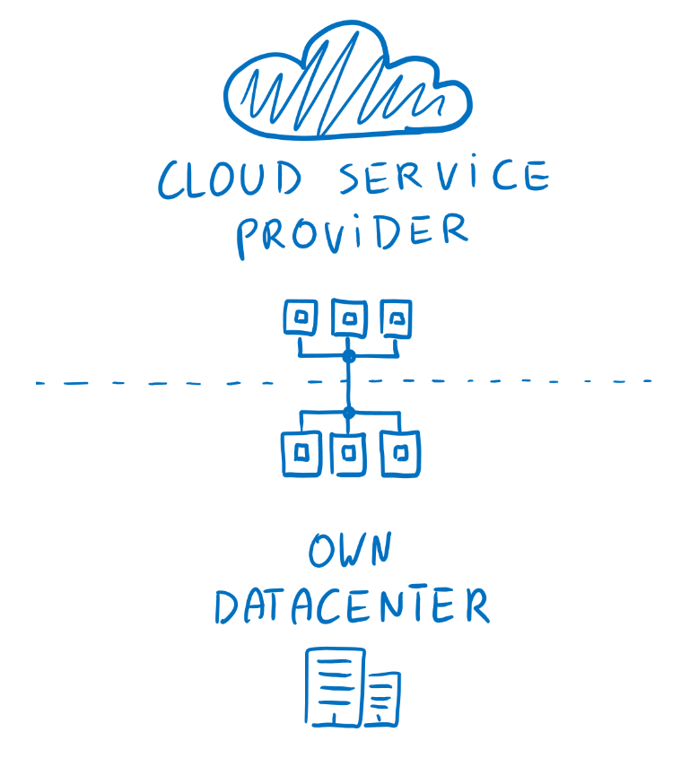

# Question 1
What is the name of the deployment model which allows for building applications by utilizing your own datacenter and 
cloud provider Infrastructure.

- [ ] Public cloud
- [x] Hybrid cloud
- [ ] Private cloud
>**Note:** The definition of hybrid _is a thing made by combining two different elements_. Combining two clouds is a 
>definition of the **Hybrid Cloud**.

# Question 2
Which cloud deployment models allow to build applications with very strict security and compliance requirements?
- [ ] Public cloud
- [x] Hybrid cloud
- [x] Private cloud
>**Note:** **With both hybrid-cloud** and **private cloud,** you can leverage internally hosted private servers to meet 
>pretty much any security requirement. 

# Question 3
Which cloud deployment model allows for greatest degree of flexibility?
- [ ] Public cloud
- [x] Hybrid cloud
- [ ] Private cloud
>**Note:** With the **hybrid cloud** customers can choose to use the public cloud or private cloud depending on your 
>scenarios. Allowing customers to implement pretty much any scenario.

# Question 4
Which cloud deployment model allows for greatest degree of control?
- [ ] Public cloud
- [ ] Hybrid cloud
- [x] Private cloud
>**Note:** With the **private cloud**, customers have access to physical servers and networking infrastructure, as they 
>can control every single aspect of the platform.

# Question 5
Which cloud deployment model allows users to take advantage of high availability, agility and consumption based model 
without a need to manage any infrastructure?
- [x] Public cloud
- [ ] Hybrid cloud
- [ ] Private cloud
>**Note:** **Public cloud** offers a multitude of benefits to their customers by simply purchasing their managed services. 
>Those benefits include high availability, agility, and consumption-based model, and more.
 
# Question 6
If you want to run legacy applications which require specialized infrastructure then which cloud deployment model(s) 
should you choose?
- [ ] Public cloud
- [x] Hybrid cloud
- [x] Private cloud
>**Note:** Some legacy applications might require sophisticated physical infrastructure/software/configuration that 
might not be available as a public cloud offers. This means customers will require their own infrastructure to run 
those which make the **private cloud** the best fit. But if a customer already has public cloud they can go into a 
**Hybrid** model. 
