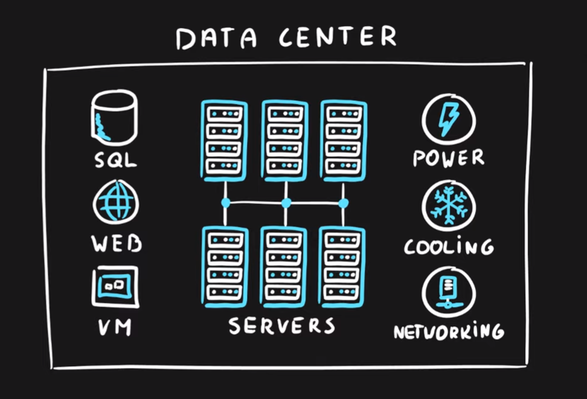
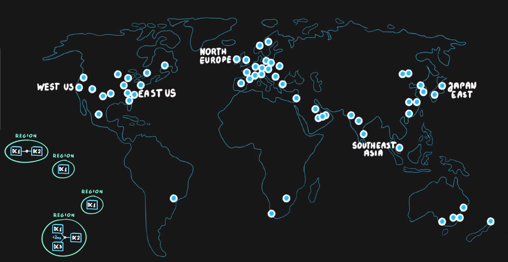
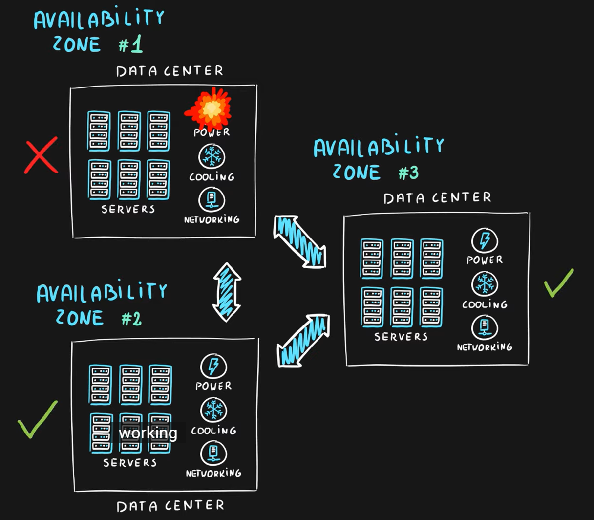
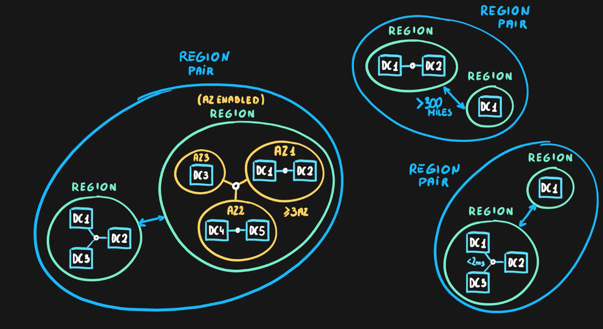
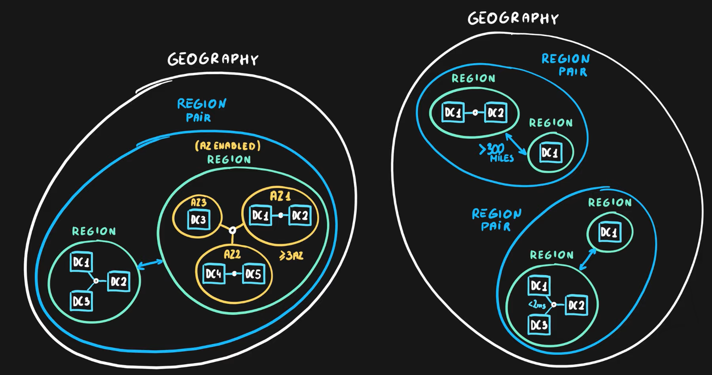

# Data Center
- **Physical facility**
- **Hosting for** group of networked **servers**
- Own **power, cooling & networking** infrastructure

# Region
- **Geographical area** on the planet
- **One but usually more datacenters** connected with **low-latency network** (<2 milliseconds)
- **Location** for your services
- Some services are **available only in certain regions**
- Some services are **global services**, as such are not assigned/deployed in specific region
- Globally available with **50+ regions**
- Special **government regions** (US DoD Central, US Gov Virginia, etc.)
- Special **partnered regions** (China East, China North)

# Availability zones
- **Regional** feature
- Grouping of **physically separate** facilities
- Designed to **protect from data center failures**
- If zone goes down **others continue working**
- Two service **categories**
  - **Zonal** services (Virtual Machines, Disks, etc.)
  - **Zone-redundant** services (SQL, Storage, etc.)
- **Not all** regions are **supported**
- **Supported** region has **three or more zones**
- A **zone** is **one or more data centers**

# Region Pair
- **Each region** is **paired** with another region making it a region pair
- Region **pairs are static** and cannot be chosen
- Each pair resides within (nằm trong cùng) the **same geography***
  - Exception is Brazil South
- **Physical isolation (Khoảng cách vật lý)** with at least 300 miles distance (when possible)
- Some services have **platform-provided replication**
- **Planned updates** across the pairs
- **Data residency** maintained for disaster recovery

| Region Pair A          | Region Pair B             |
| ---------------------- | ------------------------- |
| East US                |	West US                  |
| UK West                |	UK South                 |
| North Europe (Ireland) | West Europe (Netherlands) |
| East Asia (Hong Kong)	 | Southeast Asia (Singapore |

# Geographies
- **Discrete market**
- Typically **contains two or more regions**
- Ensures **data residency, sovereignty, resiliency**, and **compliance** requirements are met
- **Fault tolerant** to protect from region wide failures
- Broken up into areas
  - **Americas**,
  - **Europe**,
  - **Asia Pacific**,
  - **Middle East and Africa**
- Each **region belongs only to one Geography**

>**Summary:** Geographies, Regions, Physical Location, Availability Zones, Paired Regions details
https://www.azurespeed.com/Information/AzureRegions

>Use this link to find the data center which have the lowest latency to your current location:
https://azurespeedtest.azurewebsites.net/

>Note: Not all the services are available for all region so you need to find out the region's products:
https://azure.microsoft.com/en-us/global-infrastructure/services/