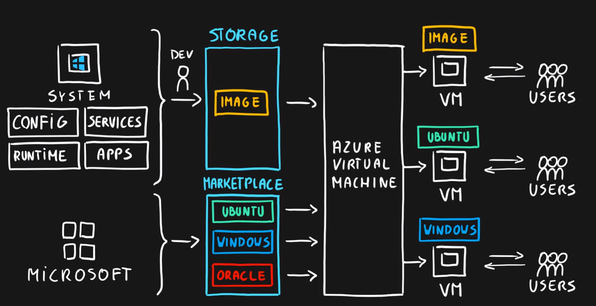
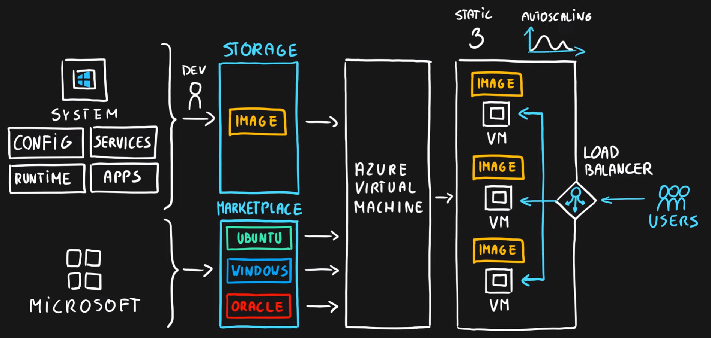
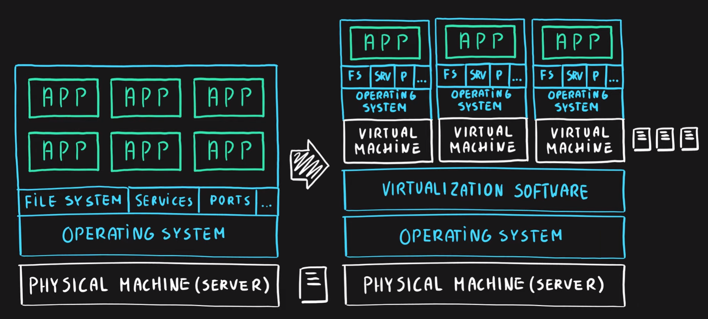
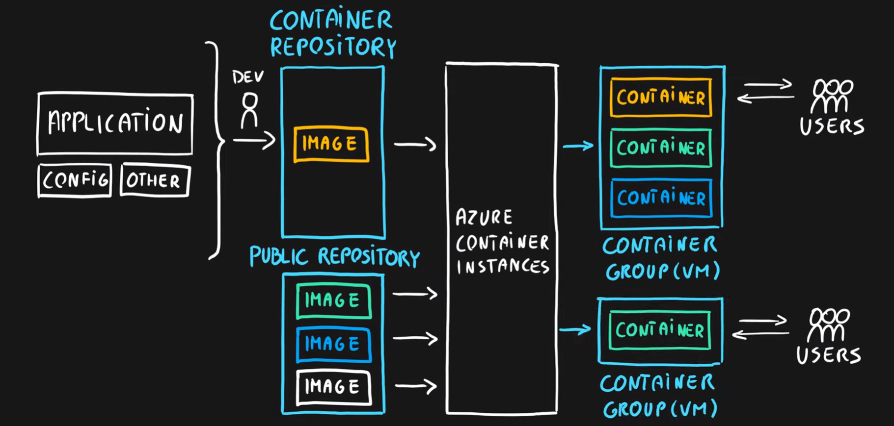
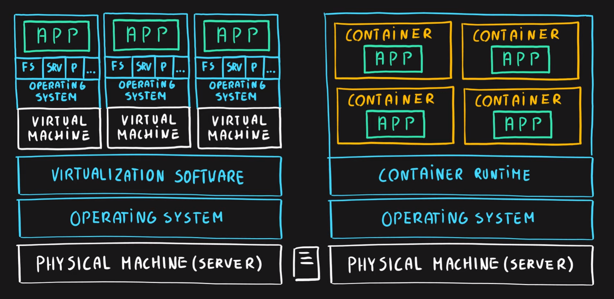
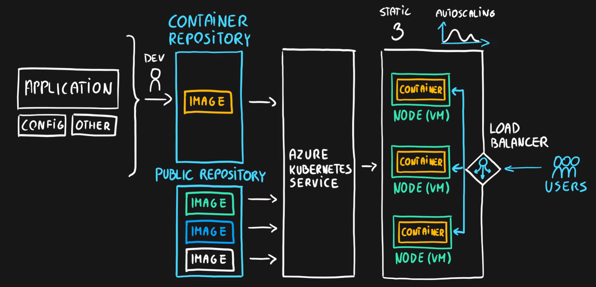
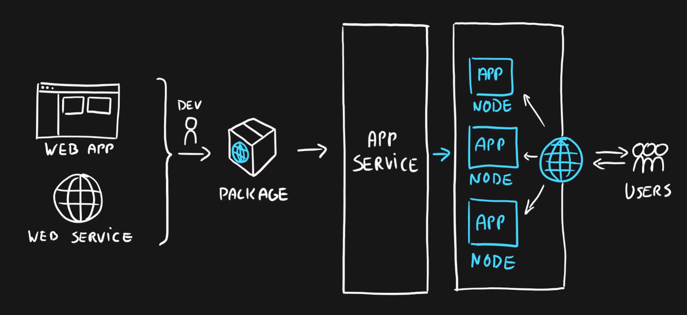
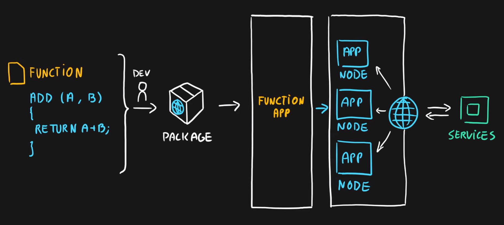
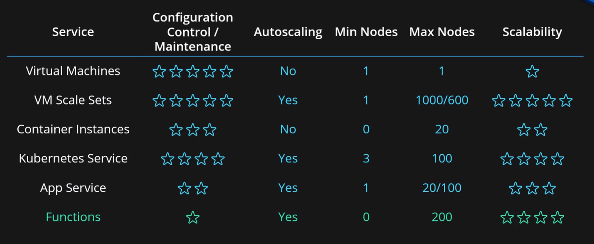

# Virtual Machines
- Infrastructure as a Service (IaaS)
- Total control over the operating system and the software
- Supports marketplace and custom images
- Best suited for
  - Custom software requiring custom system configuration
  - Lift-and-shift scenarios
- Can run any application/scenario
  - Web apps & web services,
  - Databases,
  - Desktop applications,
  - Jumpboxes,
  - Gateways, etc.
  

  
# Virtual Machine Scale Sets
- Infrastructure as a Service (IaaS)
- Set of identical virtual machines
- Built-in auto scaling features
- Designed for manual and auto-scaled workloads like web services,* batch processing, etc.

### Virtualization
- Emulation of physical machines
- Different virtual hardware configuration per machine/app
- Different operating systems per machine/app
- Total separation of environments
  - File systems
  - Services
  - Ports
  - Middleware
  - Configuration

# Azure Container Instances (Moved to Containers Service for now)
- Simplest and fastest way to run a container in Azure
- Platform as a Service
- Serverless Containers
- Designed for
  - Small and simple web apps/services
  - Background jobs
  - Scheduled scripts

### Containers
- Use host’s operating system
- Emulate operating system (VMs emulate hardware)
- Lightweight (no O/S)
  - Development Effort
  - Maintenance
  - Compute & storage requirements
- Respond quicker to demand changes
- Designed for almost any scenario

# Azure Kubernetes Service (AKS)
- Open-source container orchestration platform
- Platform as a Service
- Highly scalable and customizable
- Designed for high scale container deployments (anything really!)

# App Service
- Designed as enterprise grade web application service
- Platform as a Service
- Supports multiple programming languages and containers

# Azure Functions (Function Apps)
- Platform as a Service
- Serverless
- Two hosting/pricing models
  - Consumption-based plan
  - Dedicated plan
- Designed for micro/nano-services

# Summary
- Virtual Machines (IaaS) - Custom software, custom requirements, very specialized, high degree of control
- VM Scale Sets (IaaS) - Auto-scaled workloads for VMs
- Container Instances (PaaS) - Simple container hosting, easy to start
- Kubernetes Service (PaaS) - Highly scalable and customizable * container hosting platform
- App Services (PaaS) - Web applications, a lot of enterprise web * hosting features, easy to start
- Functions (PaaS) (Function as a Service) (Serverless) - micro/nano-services, excellent consumption-based pricing, easy to start

