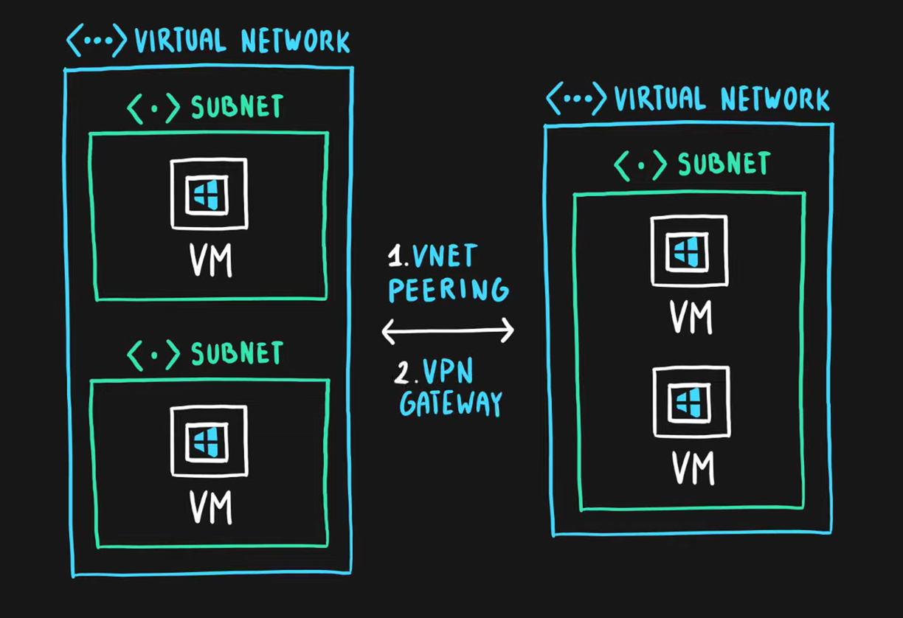
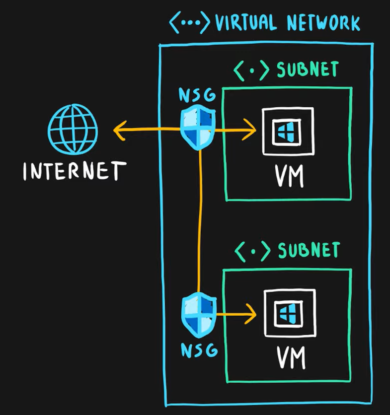
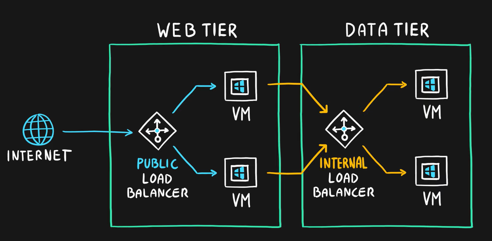
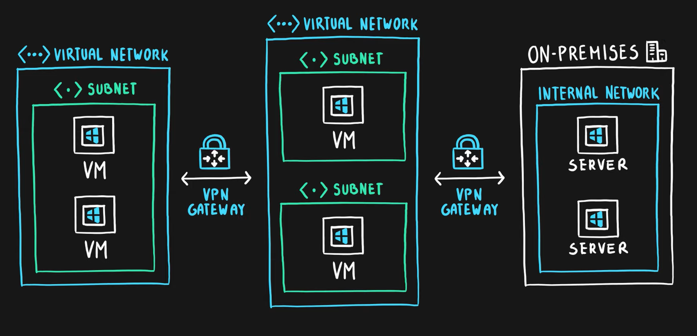
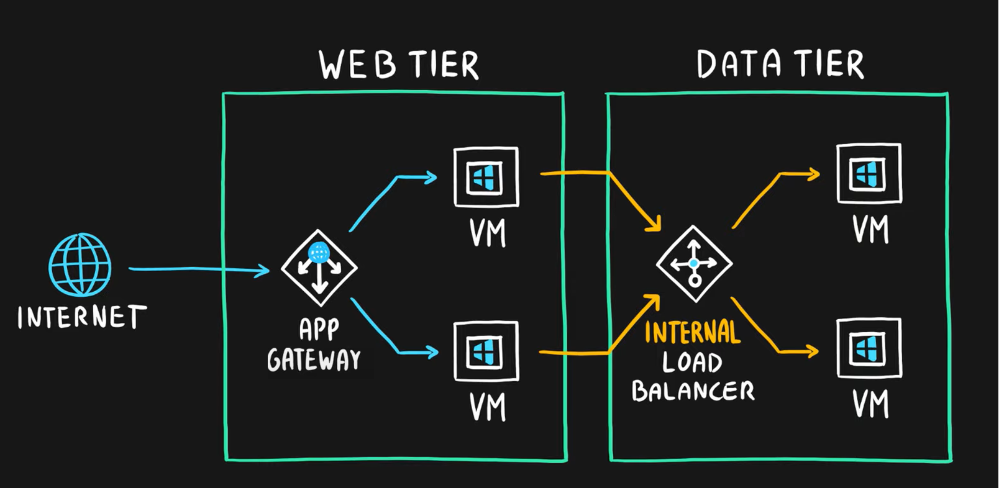
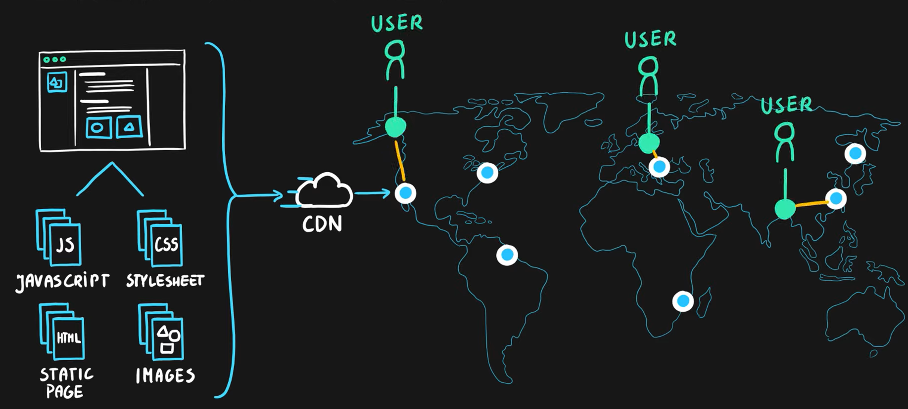
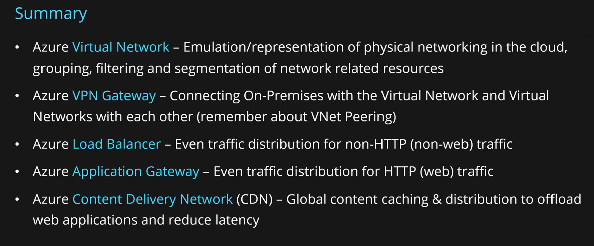

# Azure Virtual Network
- Emulation of physical networking infrastructure
- Logically isolated networking components
- Segmented into one or more subnets
- Subnets are discrete sections
- Scoped to a single region
- VNet peering or VPN Gateway allow cross region communication
- Designed for Isolation, Segmentation, Communication, Filtering, Routing between resources (internet and on-premises)
- Subnets are discrete sections used for
  - effective address allocation
  - network filtering via Network Security Groups (NSG) or Application Security Group (ASG)

# Azure Load Balancer
- Even traffic distribution
- Supports both inbound and outbound scenarios
- High-availability and scalability scenarios
- Both TCP (transmission control protocol) and UDP (user datagram protocol) applications
- Internal and External traffic
- Port Forwarding
- High scale with up to millions of flows

# VPN Gateway
- Specific type of virtual network gateway for on-premises to azure traffic over the public internet
- Cross-regional communication of azure virtual networks
  - VNet peering vs VPN gateway should be chosen based on organization needs.

# Application Gateway
- Web traffic load balancer
- Web application firewall
- Redirection
- Session affinity
- URL Routing
- SSL termination

# Content Delivery Network
- Define content
- Minimize latency
- POP (points of presence) with many locations

