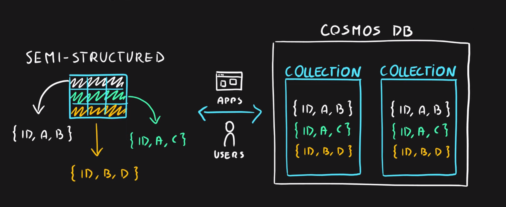
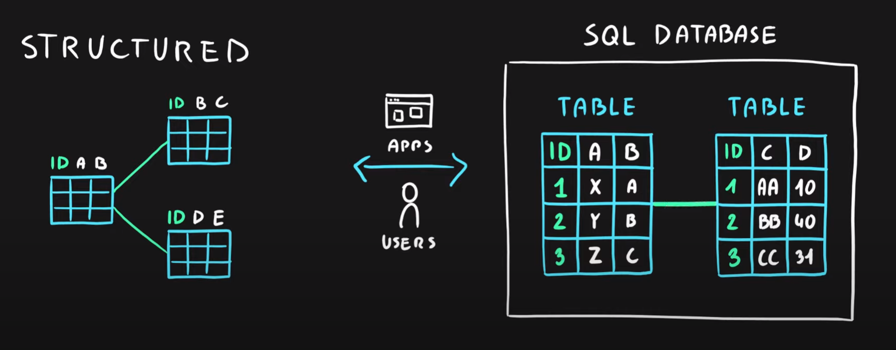

# Cosmos DB
- Globally distributed NoSQL (semi-structured data) Database service
- Schema-less
- Multiple APIs (SQL, MongoDB, Cassandra, Gremlin, Table Storage)
- Designed for
  - Highly responsive (real time) applications with super low latency responses <10ms
  - Multi-regional applications
  

  
# SQL Database
- Relational database service in the cloud (PaaS) (DBaaS - Database as a Service)
- Structured data service defined using schema and relationships
- Rich Query Capabilities (SQL)
- High-performance, reliable, fully managed and secure database for building - applications

# Azure SQL product family
Azure SQL Database – Reliable relational database based on SQL Server
- Azure Database for MySQL – Azure SQL version for MySQL database engine
- Azure Database for PostgreSQL – Azure SQL version for PostgreSQL database engine
- Azure SQL Managed Instance – Fully fledged SQL Server managed by cloud provider
- Azure SQL on VM – Fully fledged SQL Server on IaaS
- Azure SQL DW (Synapse) – Massively Parallel Processing (MPP) version of SQL Server