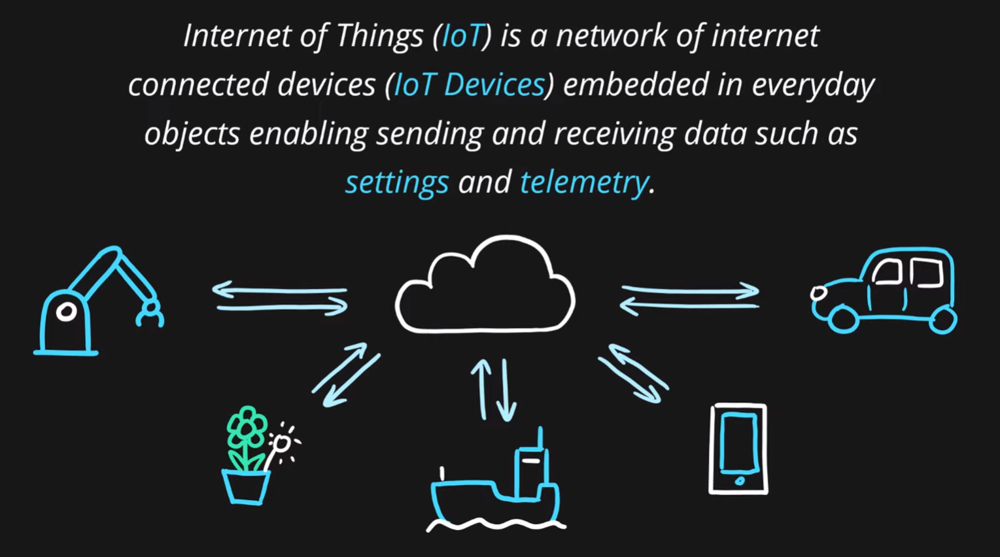
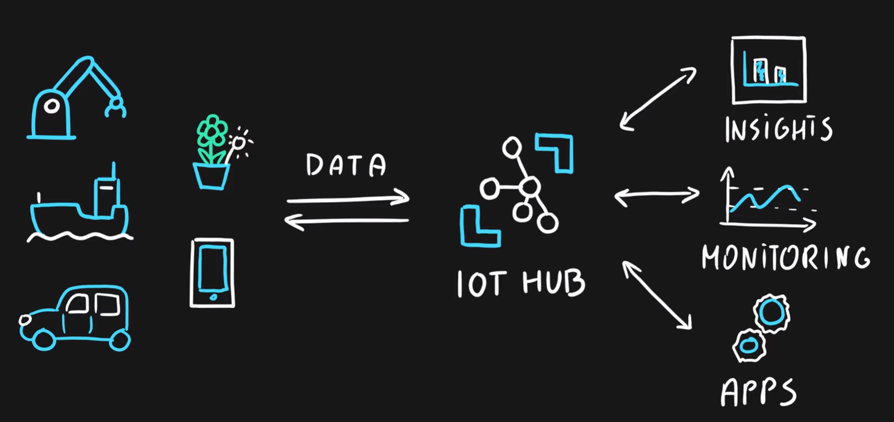
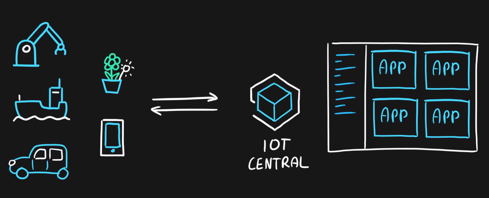
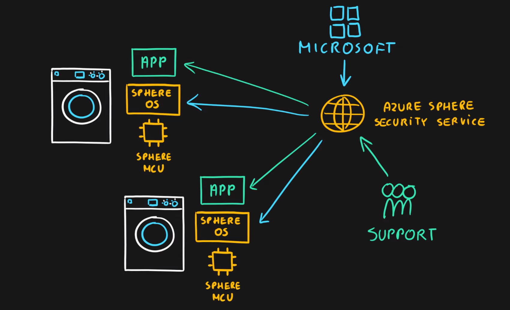

# What is Internet of Things?
Internet of Things (IoT) is a network of internet connected devices (IoT Devices) embedded in everyday objects enabling sending and receiving data such as settings and telemetry.

# Azure Iot Hub
- Managed service for bi-directional communication
- Platform as a Service (PaaS)
- Highly secure, scalable and reliable
- Integrates with a lot of Azure Services
- Programmable SDKs for popular languages (C, C#, Java, Python, Node.js)
- Multiple protocols (HTTPS, AMQP, MQTT)

# Azure IoT Central
- IoT App Platform - Software as a Service (SaaS)
- Industry specific app templates
- No deep technical knowledge required
- Service for connecting, management and monitoring IoT devices
- Highly secure, scalable and reliable
- Built on top of the IoT Hub service and 30+ other services

# Azure Sphere
- Secure end-2-end IoT Solutions
  - Azure Sphere certified chips (microcontroller units - MCUs)
  - Azure Sphere OS based on Linux
  - Azure Security Service trusted device-to-cloud communication
  
