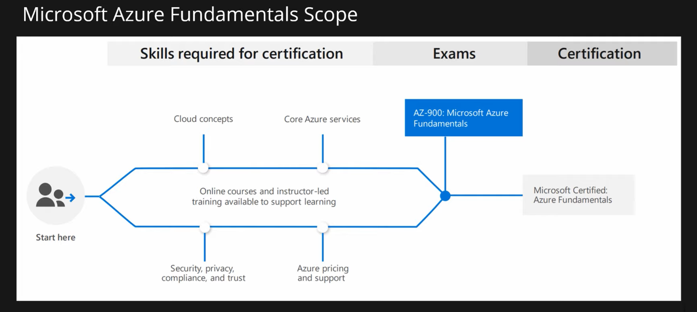

# AZ-900 Microsoft Azure Fundamentals certification

## Path Overview

## Study Areas (Modules)

| AZ 900 Study Areas                                    | Weights  |
| ----------------------------------------------------- | -------- |
| Cloud concepts                                        | 15 - 20% |
| Core Azure services                                   | 30 - 35% |
| Security, privacy, compliance & trust                 | 25 - 30% |
| Azure pricing, service level agreements & lifecycle   | 20 - 25% |

# Cloud concepts
- **Episode 1:** Cloud Computing, High Availability, Scalability, Elasticity, Agility, Fault Tolerance, and Disaster Recovery
- **Episode 2:** Principles of economies of scale
- **Episode 3:** Capital Expenditure (CapEx) vs Operational Expenditure (OpEx) and their differences
- **Episode 4:** Consumption-based model
- **Episode 5:** IaaS, PaaS, SaaS and their differences
- **Episode 6:** Public, Private, Hybrid cloud and their differences

# Core Azure services
- **Episode 7:** Azure Regions and Availability Zones
- **Episode 8:** Azure Resource Groups and Resource Manager
- **Episode 9:** Azure Compute Services | Virtual Machine, VM Scale Set, App Service, Functions, Container Instances, Kubernetes Service
- **Episode 10:** Azure Networking Services | Virtual Network, Load Balancer, VPN Gateway, Application Gateway, CDN
- **Episode 11:** Azure Storage Services | Blob, Disk, File and Archive
- **Episode 12:** Database Services | Cosmos DB, SQL Database, SQL DB for MySQL and PostgreSQL, SQL Managed Instance
- **Episode 13:** Azure Marketplace
- **Episode 14:** Azure IoT Services | IoT Hub, IoT Central, Azure Sphere
- **Episode 15:** Azure Big Data and Analytics Services | Synapse Analytics (SQL Datawarehouse), HDInsight, Databricks
- **Episode 16:** Azure Artificial Intelligence (AI) Services | Machine Learning Studio and Service
- **Episode 17:** Azure Serverless Computing Services | Functions, Logic Apps, Event Grid
- **Episode 18:** Azure DevOps Solutions | Azure DevOps, DevTest Labs
- **Episode 19:** Azure Tools | Portal, PowerShell, CLI and CloudShell
- **Episode 20:** Azure Advisor

# Security, privacy, compliance & trust
- **Episode 21:** Security Groups | NSG and ASG | Network Security Groups and Application Security grouyps
- **Episode 22:** User-defined Routes (UDR)
- **Episode 23:** Azure Firewall
- **Episode 24:** Azure DDoS Protection
- **Episode 25:** Azure Identity Services | Identity, Authentication, Authorization & Azure AD
- **Episode 26:** Azure Security Center and usage scenarios
- **Episode 27:** Key Vault
- **Episode 28:** Role-Based Access Control (RBAC)
- **Episode 29:** Resource Locks
- **Episode 30:** Tags
- **Episode 31:** Azure Policy
- **Episode 32:** Azure Blueprints
- **Episode 33:** Cloud Adoption Framework
- **Episode 34:** Core tenets of Security, Privacy, and Compliance

# Azure pricing, service level agreements & lifecycle
- **Episode 35:** Cost Affecting Factors
- **Episode 36:** Cost Reduction Methods and Pricing, TCO Calculators
- **Episode 37:** Azure Cost Management
- **Episode 38:** Azure Service Level Agreement (SLA)
- **Episode 39:** Service lifecycle in Azure